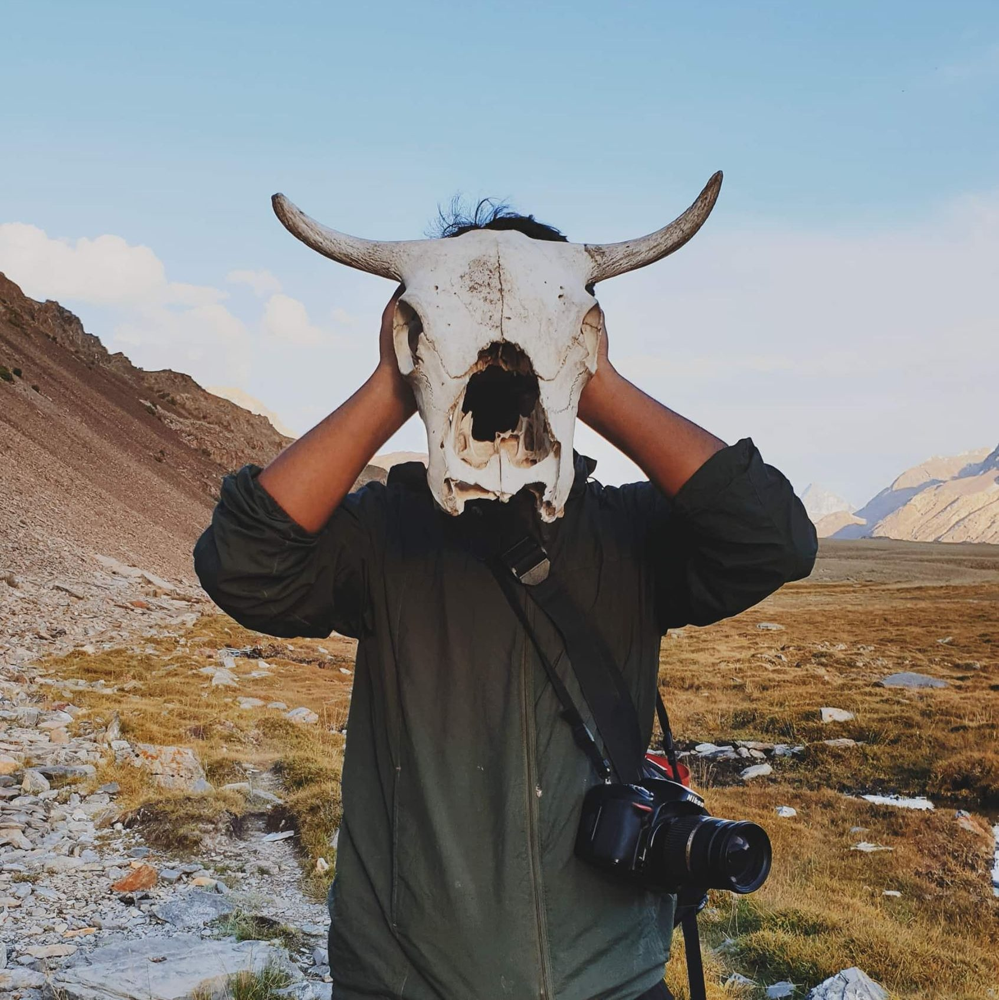

A **Creator, Writer, Traveler, and Climate Researcher**.

I am fond of exploring distant lands, mountain tops, and forests, the unseen where nobody walks. It brings me close to my roots, connecting me to the mother earth, the origin of all life. So I keep looking for ways to pay respects to life.

But man’s greed for more has gone too far. His destructive hands have mutilated our ecosystems. The invasive industrialization that man calls advancement now threatens all life. Don’t get me wrong; I am down for human growth, but not how it is happening.

You go to the countryside, hoping to find a quiet reprieve, a shelter for your mind and soul, but you meet disappointment. Stumps of freshly logged trees welcome you. In place of wildflowers, you meet plastic wraps. And sometimes, you come across a stray cat or a dog, turned dead, choking on human trash.

We need to save them!

# Saving the planet

Being a professional engineer, I have become more conscious of my own environmental impacts. My workplace mainly dealt with plastic products, so I had to find something new, a job that wasn’t a part of the problem, a place that took responsibility. 

So I changed that.

# Inking my heart

I have a passion for writing and have been creating poetry and prose since my school days.  My short story titled “Giddar Singhi” won South Asia Microfiction Award in 2020. I am also currently working on my anthology and hope to publish it this year.

While I was studying engineering, a friend and I started a university magazine called "Zeest" that published student writings.

Huma Adnan, a poetess and a novelist with hree books to her credit, and I have recently started an online community called "Appolo Writes" for budding writers, where we train and encourage them to keep writing. We hope to make it a one-stop publishing solution.

